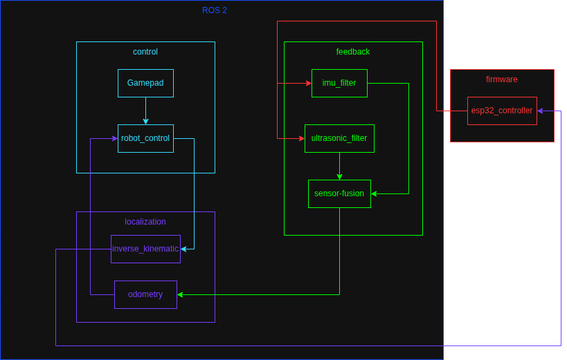

# Wall-E

micro-ROS workspace for ESP32 (FreeRTOS + ESP-IDF) with ROS 2 Humble.

For a user-focused setup and operation guide, see [user_manual.md](user_manual.md).

This repository includes:

- ESP32 firmware app: `firmware/custom/esp32_controller`
- micro-ROS firmware workspace: `firmware/mcu_ws`
- Host ROS 2 workspace: `src`, `build`, `install`
- micro-ROS agent container (UDP 9999)

## Documentation Map

- User guide: [user_manual.md](user_manual.md)
- Concepts guide: [concepts.md](concepts.md)
- Theoretical calculation summary: [notes.md](notes.md)
- Sphinx docs index: `docs/source/index.rst`

The Sphinx site includes the same high-level concepts and firmware details in a published format.

## Prerequisites

- Docker
- Docker Compose
- USB access for flashing (device usually `/dev/ttyUSB0`)

## Quick Start

From the repository root:

1. Start workspace and agent

``` bash
docker compose up -d
```

2. Enter workspace container

``` bash
docker exec -it micro_ros_workspace bash
```

3. Build host ROS 2 workspace (if needed)

``` bash
cd /micro_ros_ws
colcon build
```

4. Source the environment

``` bash
source /opt/ros/humble/setup.bash
source /micro_ros_ws/install/setup.bash
```

If you launch RViz or Gazebo GUI from the container and see `Authorization required, but no authorization protocol specified`, run `xhost +si:localuser:root` on the host before starting the container. This workspace uses X11 forwarding, and the container runs as root by default.

## Launch and Visualization Updates (2026-04-17)

- `wall_e.launch.py` now generates `robot_description` using the Python xacro API (`xacro.process_file(...).toxml()`) instead of shelling out to the `xacro` executable.
- `gazebo_ros` remains optional at launch time. If unavailable, launch continues with a clear log message.
- Rear wheel TF visibility in RViz is now guaranteed even when `joint_state_publisher` is disabled:
  - rear wheel static TF publishers are started by default
  - they are automatically disabled when `use_joint_state_publisher:=true`
- Fresh containers should include runtime ROS GUI/model dependencies from `Dockerfile` (`ros-humble-xacro`, `ros-humble-rviz2`, `ros-humble-gazebo-ros-pkgs`, `ros-humble-joint-state-publisher`).

If your currently running container was created before these package updates, rebuild it:

``` bash
docker compose up --build -d
```

## Build ESP32 Firmware

Inside the workspace container:

1. Configure firmware app and transport

``` bash
ros2 run micro_ros_setup configure_firmware.sh esp32_controller -t udp -i 192.168.1.2 -p 8888
```

2. Build firmware

``` bash
ros2 run micro_ros_setup build_firmware.sh
```

3. Firmware output files

``` bash
firmware/freertos_apps/microros_esp32_extensions/build/esp32_controller.bin
firmware/freertos_apps/microros_esp32_extensions/build/esp32_controller.elf
```

## Flash ESP32 Firmware

Inside the workspace container (requires serial device access):

1. Flash

``` bash
ros2 run micro_ros_setup flash_firmware.sh
```

If your board is not `/dev/ttyUSB0`, update `docker-compose.yaml` device mapping or run a custom docker command with the correct `--device` mapping.

## Monitor ESP32 Logs (ESP-IDF)

Inside the workspace container:

``` bash
cd /micro_ros_ws/firmware/freertos_apps/microros_esp32_extensions
source /micro_ros_ws/firmware/toolchain/esp-idf/export.sh
idf.py -p /dev/ttyUSB0 monitor
```

You can also build then monitor:

``` bash
idf.py build
idf.py -p /dev/ttyUSB0 monitor
```

## Run In Wokwi (Simulation)

Wokwi does not use `/dev/ttyUSB0`. It loads your firmware `.bin`/`.elf` directly.

1. Ensure `wokwi.toml` points to the generated firmware files:

``` toml
[wokwi]
version = 1
firmware = "firmware/freertos_apps/microros_esp32_extensions/build/esp32_controller.bin"
elf = "firmware/freertos_apps/microros_esp32_extensions/build/esp32_controller.elf"
```

2. Build firmware before starting simulator:

``` bash
docker exec micro_ros_workspace bash -lc "cd /micro_ros_ws/firmware/freertos_apps/microros_esp32_extensions && source /micro_ros_ws/firmware/toolchain/esp-idf/export.sh && idf.py build"
```

3. Start Wokwi from VS Code command palette: `Wokwi: Start Simulator`.

4. Read logs in VS Code `Output` panel, `Wokwi` channel (or `Wokwi Terminal`, depending on extension version).

If logs still do not appear, stop simulation, reload VS Code window, and start simulator again.

## WiFi Provisioning System

Both ESP32 controller apps (motor-enabled and sensor-only) include a **browser-based WiFi provisioning system** for easy credential setup without source code editing.

### How It Works

1. **First Boot (No Credentials)**
   - Device starts WiFi access point: `ESP32-Setup` (open, no password)
   - HTTP provisioning server launches on `http://192.168.4.1/`

2. **User Setup**
   - Connect laptop/phone to `ESP32-Setup` network
   - Open browser to `http://192.168.4.1/`
   - Enter WiFi SSID and password via form
   - Device saves credentials to NVS flash (persistent)

3. **Subsequent Boots**
   - Device reads stored credentials from NVS
   - Connects to configured WiFi in normal station mode
   - Proceeds with ROS 2 and sensor initialization

### Credential Storage

- **Location**: NVS flash partition, namespace `"wifi_creds"`
- **Persistence**: Survives power cycles and resets
- **Fallback**: Kconfig symbols `CONFIG_ESP_WIFI_SSID` / `CONFIG_ESP_WIFI_PASSWORD` (for build-time defaults)

### Architecture

The provisioning system includes:

- `nvs_read_wifi_creds()`: Load SSID/password from flash
- `nvs_write_wifi_creds()`: Save credentials after form submission
- SoftAP initialization for open access point
- Simple HTML form with POST handler for credential entry
- Automatic server shutdown after successful provisioning

### Applicable Apps

- `firmware/custom/esp32_controller/`: Motor + sensor controller with full provisioning
- `firmware/freertos_apps/apps/esp32_controller/`: Sensor-only reference variant (provisioning included)

## Run micro-ROS Agent

The compose service starts this automatically:

``` bash
microros/micro-ros-agent:humble udp4 --port 9999
```

You can check logs with:

``` bash
docker logs -f micro_ros_agent
```

## Sensor Processing Pipeline (Host)

The firmware publishes raw sensor topics:

- `/imu/data` (`sensor_msgs/msg/Imu`)
- `/range/data` (`sensor_msgs/msg/Range`)

Host-side ROS 2 nodes can process these into cleaner and fused signals:

- `wall_e_ws/src/feedback/feedback/imu_filter.py`
  - Input: `/imu/data`
  - Output: `/imu/filter`
- `wall_e_ws/src/feedback/feedback/ultrasonic_filter.py`
  - Input: `/range/data`
  - Output: `/range/filter`
- `wall_e_ws/src/feedback/feedback/sensor_fusion.py`
  - Inputs: `/imu/filter`, `/range/filter`
  - Outputs: `/fusion/height`, `/fusion/vertical_velocity`, `/fusion/debug`

This keeps firmware responsibilities focused on sensor I/O and control while allowing filter tuning on the host.

## Control and Localization Pipeline (Host)

Current host-side runtime flow:

- `control/gamepad_node`
  - Publishes `/gamepad`
- `control/robot_control_node`
  - Inputs: `/gamepad`, `/range/filter`, `/imu/filter`, `/odom`
  - Outputs: `/cmd_vel`, `/servo_cmd`
  - Supports manual mode and cascaded closed-loop mode:
    - outer P/PD position-to-speed setpoint
    - inner PI speed tracking loop
  - Also maps a gamepad axis to `/servo_cmd` (`std_msgs/msg/Float32`, angle in degrees)
- `localization/odometry_node`
  - Inputs: `/cmd_vel`, `/imu/filter`, `/range/filter`, `/fusion/height`, `/fusion/vertical_velocity`
  - Output: `/odom`
- `localization/inverse_kinematic_node`
  - Input: `/cmd_vel`
  - Output: `/motor_cmd` (4-wheel command array)

## System Architecture Diagram



Flow summary:

- `esp32_controller` publishes raw IMU and range data to ROS 2.
- `imu_filter` and `ultrasonic_filter` produce cleaner feedback streams.
- `sensor_fusion` combines filtered streams for downstream state estimation.
- `odometry_node` estimates vehicle state and publishes `/odom`.
- `robot_control_node` generates `/cmd_vel` using gamepad + safety + PI hold.
- `robot_control_node` also publishes `/servo_cmd` from gamepad axis input (with configurable limits/default).
- In closed-loop mode, PI acts on speed error (not direct position error).
- `inverse_kinematic_node` converts `/cmd_vel` into `/motor_cmd` for firmware actuation.

## Useful Commands

- Rebuild host workspace

``` bash
docker exec -it micro_ros_workspace bash -lc "cd /micro_ros_ws && colcon build"
```

- Rebuild firmware

``` bash
docker exec -it micro_ros_workspace bash -lc "source /opt/ros/humble/setup.bash && source /micro_ros_ws/install/setup.bash && ros2 run micro_ros_setup build_firmware.sh"
```

## Latest Firmware Debug Notes (2026-04-10)

- Confirmed firmware path in use is `firmware/custom/esp32_controller`.
- MPU startup now includes gyro bias calibration (`200` samples). Keep robot still at boot for best drift reduction.
- Ultrasonic timeout message `Ultrasonic timeout(wait high)` means no rising edge was seen on ECHO.
- After wiring/level correction, ultrasonic produced valid pulse widths around `344-401 us` (`~0.059-0.069 m` in test setup).
- Reboot right after `Starting ROS node setup...` was traced to watchdog interaction in startup; the firmware now logs watchdog delete/add status around ROS init.
- `NVS open for read failed: 0x1102` is expected when WiFi credentials are not yet stored in namespace `wifi_creds`.

- Stop everything

``` bash
docker compose down
```

## Troubleshooting

- Package `micro_ros_setup` not found
  Source both setup files:

``` bash
source /opt/ros/humble/setup.bash
source /micro_ros_ws/install/setup.bash
```

- Launch error: `file not found: [Errno 2] No such file or directory: 'xacro'`
  Install xacro in the running container (or rebuild image after pulling latest Dockerfile updates):

``` bash
apt-get update && apt-get install -y ros-humble-xacro
```

- Launch/CLI says `Package not found` for `rviz2` or `gazebo_ros`
  Your container is missing GUI/simulation runtime packages. Rebuild with the updated image:

``` bash
docker compose up --build -d
```

- RViz RobotModel shows `No transform from rear_left_wheel` or `rear_right_wheel`
  This is now handled in the launch file by publishing rear-wheel static transforms when `joint_state_publisher` is off.
  If you still see it, restart launch and verify you are using the updated `wall_e.launch.py`.

- Docker compose fails on `/dev/ttyUSB0`
  Your host may expose a different serial device. Adjust `docker-compose.yaml` accordingly.

- Build fails with Git safe.directory for esp-idf
  Run in container:

``` bash
git config --global --add safe.directory /micro_ros_ws/firmware/toolchain/esp-idf
```

- ESP-IDF monitor fails with `Device or resource busy: '/dev/ttyUSB0'`
  Another process is already using the serial port. Close any existing `screen`, `idf.py monitor`, or other serial tool and retry.
  To find the owner:

``` bash
fuser -v /dev/ttyUSB0
lsof /dev/ttyUSB0
```

- `make menuconfig` fails with `python: No such file or directory`
  Install Python alias in the container:

``` bash
apt-get update && apt-get install -y python-is-python3
```

- ESP-IDF Python dependency warnings (`pkg_resources`, setuptools)
  For ESP-IDF v4.1, pin setuptools in the IDF virtualenv:

``` bash
VENV=/root/.espressif/python_env/idf4.1_py3.10_env
$VENV/bin/python -m pip install --upgrade pip
$VENV/bin/python -m pip install "setuptools<81" wheel
```

- Runtime crash: `assertion "netif" failed` in `esp_netif_create_default_wifi_sta`
  Cause: duplicate default STA netif creation.
  Fix applied in:
  - `firmware/freertos_apps/apps/esp32_controller/app.c`
  - `firmware/custom/esp32_controller/app.c`

  If this reappears after syncing app sources, ensure Wi-Fi init runs once and `esp_netif_create_default_wifi_sta()` is not called multiple times.

- Wi-Fi behavior on mobile hotspots
  If connection is unstable, force hotspot to 2.4 GHz WPA2 and disable battery-saving/idle sleep on the phone.

- Wokwi simulator starts but no logs are visible
  Usually caused by stale build artifacts or viewing the wrong panel.
  Rebuild firmware, restart simulation, and check VS Code `Output` -> `Wokwi`.

## Project Layout

- `src`: ROS 2 packages
- `firmware/custom/esp32_controller: app source`
- `firmware/freertos_apps/microros_esp32_extensions`: generated ESP-IDF project
- `firmware/mcu_ws`: micro-ROS cross-compiled workspace
- `docs`: Sphinx documentation
